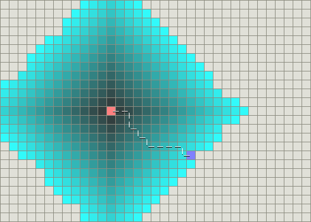

# A*算法

## Dijkstra算法



使用广度优先算法来计算最短路径，使用这种方法可以准确的找的路径为最短路径，但是这种方式也有一个明显的缺点，该方式运行得较慢

## 最佳优先搜索（BFS）


BFS是基于贪心策略，它不能保证找到一条最短路径，它比Dijkstra算法快的多，它用了一个启发式函数快速地引导目标走向结点，不需要广度优先算法一样需要对周围路径全搜索


如上图所示，虽然BFS运行得较快，但是它找到的路径明显不是一条好的路径

## A*算法

把启发式方法和常规方法如Dijsktra算法结合在一起的算法。有点不同的是，启发式方法经常给出一个近似解而不是保证最佳解。然而，尽管A*基于无法保证最佳解的启发式方法，A*却能保证找到一条相对合适的最短路径。

f(n) = g(n) + h(n)

以以上函数作为A*算法的公式，g(n)表示从初始结点到任意结点n的代价，h(n)表示从结点n到目标点的启发式评估代价

启发式函数可以对A*算法进行控制，h(n)越大，A*算法的速度越快，精确度越低，相反，h(n)越大，A*算法的速度越满，精确度越高

### 启发式函数

选择一个合适的启发式函数对于A*算法很重要

#### 曼哈顿距离
```
h(n) = D * (abs ( n.x – goal.x ) + abs ( n.y – goal.y ) ) 
```
D为每个单位移动的代价

#### 对角线距离
```
h(n) = D * max(abs(n.x - goal.x), abs(n.y - goal.y))
```
如果对角线运动的代价不是D，但类似于D2 = sqrt(2) * D，则上面的启发函数不准确。你需要一些更准确（原文为sophisticated）的东西：
```
h_diagonal(n) = min(abs(n.x - goal.x), abs(n.y - goal.y))
h_straight(n) = (abs(n.x - goal.x) + abs(n.y - goal.y))
h(n) = D2 * h_diagonal(n) + D * (h_straight(n) - 2*h_diagonal(n)))
```

#### 欧几里得距离
```
h(n) = D * sqrt((n.x-goal.x)^2 + (n.y-goal.y)^2)
```

## 算法实现

用golang语言实现一个二维地图的A*识路算法

定义坐标和地图

```go
// 坐标
type Point struct {
	x    int
	y    int
	view string // 类型 （. 为路径， X 为障碍物）
}

// 地图
type Map struct {
	points [][]Point         // 地图坐标点
	blocks map[string]*Point // 障碍点
	maxX   int               // 最大X的坐标点
	maxY   int               // 最大Y的坐标点
}
```

定义识别路径

```go
// 单个路径点信息
type PassPoint struct {
	Point
	father *PassPoint // 上一个路径点的信息
	gVal   int
	hVal   int
	fVal   int
}

type SearchRoad struct {
	theMap  *Map                  // 地图
	start   PassPoint             // 起点
	end     PassPoint             // 终点
	closeLi map[string]*PassPoint // 关闭列表
	openLi  OpenList              // 开放列表（利用最小堆）
	openSet map[string]*PassPoint // 计算路径记录
	TheRoad []*PassPoint          // 寻找到的路径
}
```

定义启发函数

```go
// 记录A*算法的H值 (曼哈顿距离)
func (this *PassPoint) calcHVal(end *PassPoint) int {
	this.hVal = int(math.Abs(float64(end.x-this.x)) + math.Abs(float64(end.y-this.y)))
	return this.hVal
}
```

查询路径

```go
for len(this.openLi) > 0 {
    // 将节点从开放列表移到关闭列表当中。
    x := heap.Pop(&this.openLi)
    curPoint := x.(*PassPoint)
    delete(this.openSet, pointAsKey(curPoint.x, curPoint.y))
    this.closeLi[pointAsKey(curPoint.x, curPoint.y)] = curPoint
    adjacs := this.theMap.getAdjacentPoint(&curPoint.Point)
    for _, p := range adjacs {
        theAP := NewPassPoint(p, curPoint, &this.end)
        if pointAsKey(theAP.x, theAP.y) == pointAsKey(this.end.x, this.end.y) {
            // 找出路径了, 标记路径
            for theAP.father != nil {
                this.TheRoad = append(this.TheRoad, theAP)
                theAP.view = PROINT_VIEW_TYPE_3
                theAP = theAP.father
            }
            return true
        }
        _, ok := this.closeLi[pointAsKey(p.x, p.y)]
        if ok {
            continue
        }
        existAP, ok := this.openSet[pointAsKey(p.x, p.y)]
        if !ok {
            heap.Push(&this.openLi, theAP)
            this.openSet[pointAsKey(theAP.x, theAP.y)] = theAP
        } else {
            oldGVal, oldFather := existAP.gVal, existAP.father
            existAP.father = curPoint
            existAP.calcGVal()
            // 如果新的节点的G值还不如老的节点就恢复老的节点
            if existAP.gVal > oldGVal {
                // restore father
                existAP.father = oldFather
                existAP.gVal = oldGVal
            }
        }
    }
}
```

定义测试地图

```
...........................
XXXXX......................
...........................
X.XXXXXXXXX..XXXXXXXXXXXXXX
...........................
...........................
...........................
...........................
.........XXXXXX............
...........................
...........................
XXXXXXXXXXX.XXXXXXXXXXXX.XX
...........................
...........................
...........................
........XXXXXX.............
...........................
...........................
...........................
```

运行结果

```
S****......................
XXXXX*.....................
......*****................
X.XXXXXXXXX*.XXXXXXXXXXXXXX
..........*................
.........*.................
........*..................
........*..................
........*XXXXXX............
.........*.................
..........*................
XXXXXXXXXXX*XXXXXXXXXXXX.XX
..........*................
.........*.................
........*..................
.......*XXXXXX.............
........*..................
.........*.................
..........E................
```

