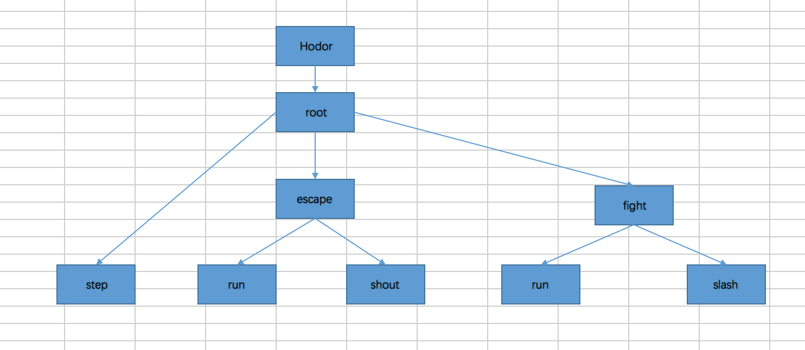

## 理解行为树，你需要这个最简模型

行为树在游戏中被广泛用于设计游戏AI，但它是什么？又是怎么实现的呢？

按照历史经验，我们理解一个新的理论事物，首先应该建立一个最简模型，以便降低理解难度。

行为树，就是一棵树，对，它就是一棵树！

曾经有一个伟大的程序员说过这么一句至理名言：

好的数据结构确定之后，好的算法便不言而喻。

在程序世界观不至于崩溃的情况下，可以这么简单认为:

行为树，就是以树为骨，以遍历为魂的搜索方案。

树，是其数据结构，遍历，是其算法，目的就是为了查找。

好吧，数据结构课本上的几大关键词都出来了。

### 行为树的最简定义

行为树：
>> 以逻辑节点和行为节点组成的树形数据结构。每执行一次决策逻辑，需要从根节点出发，遍历子节点，根据准入条件，选出符合条件的行为节点并执行之。

逻辑节点：
>> 控制遍历路线的节点。

>> 逻辑节点分为三种：

>>>>选择节点（Selector）：选择其子节点的某一个执行

>>>>序列节点（Sequence）：将其所有子节点依次执行

>>>>并行节点（Parallel）：将其所有子节点都运行一遍

行为节点：

>> 执行最终行为逻辑的节点，也就是行为树的叶子节点。在游戏中可以是游戏实体的闲置，逃跑，攻击等行为。

准入条件：

>> 是否能够执行节点逻辑的判断条件 


行为节点的状态：

>> 运行中（Executing）：该行为还在处理中

>> 完成（Completed）：该行为处理完成，成功或者失败

通过上述概念，可以看出，行为树跟普通树形数据结构最大的区别，就是把节点分为职责明确的控制节点和执行节点，通过二者的协作来控制搜索路径。

至此，相信你已经在脑海中建立行为树的最简模型。

### 举个栗子

现在我们将用一个例子将上述概念串联起来，来驱动我们的最简模型。

业务描述：

在维斯特洛大陆上，有个英俊而微胖的骑士，名叫Hodor，在降生之初便被上帝随机赋予一个战力值。
它独自游荡在阴森幽暗丛林中，危险四伏，每一步有50%的几率出现怪物，而怪物有50%的概率战力高于Hodor。
Hodor在面对危险时采取聪明人的处事策略，打不过就跑，打得过就上，遇到战力高于自身的怪物立马逃跑，反之就会跑过去攻击。



如图根据上述业务建模：

根节是一个选择节点，挂载在Hodor身上，该节点有三个子节点。
step是一个行为节点，执行漫步游走逻辑。
escape是一个改造的平行节点。它有两个子节点，奔跑和喊叫，都是行为节点，用来控制Hodor逃跑的时候，一边奔跑，一边大喊大叫。
fight是一个改造的序列节点。他有两个子节点，奔跑和挥刀进攻，都是行为节点，用来控制Hodor战斗时，奔跑到怪物面前， 然后攻击。

理解完业务逻辑，我们该怎么用代码实现它呢？

首先，我们看下实现一个最简行为树的框架所必备的几个元素。

* 黑板，节点间共享的数据的地方。我们封装一个map来实现。

```go
/*
	黑板结构体
	提供基础类型的Get Set方法用于节点间共享数据
 */
type BlackBoard struct {
	board map[int]interface{}
}

```

* 抽象节点接口及基础实现

```go
/*
	行为树节点抽象接口
 */
type IBTNode interface {
	SetParent(node IBTNode) // 设置父节点
	AddNode(node IBTNode)   // 添加子节点
	PreCondition() bool     // 准入条件判断
	Execute() bool          // 执行逻辑
}

/*
	行为树基础节点实现
 */
type BTNode struct {
	Parent   IBTNode
	Children []IBTNode
}

func NewBTNode(parent IBTNode) *BTNode {
	return &BTNode{
		Parent:   parent,
		Children: make([]IBTNode, 0),
	}
}

func (bt *BTNode) SetParent(node IBTNode) {
	bt.Parent = node
}

func (bt *BTNode) AddNode(node IBTNode) {
	if node != nil {
		node.SetParent(bt)
	}
	bt.Children = append(bt.Children, node)
}


func (bt *BTNode) PreCondition() bool {
	return true
}

func (bt *BTNode) Execute() bool {
	return true
}

```

* 行为节点实现

```go
/*
	行为节点 闲置
 */
type ActionIdle struct {
	*BTNode // 内嵌节点的基础实现
}

// 闲置节点的构造函数
func NewActionIdle(parent IBTNode) *ActionIdle {
	return &ActionIdle{
		BTNode: NewBTNode(parent),
	}
}

// 前置逻辑 可用于实现游戏实体的前摇逻辑
func (a *ActionIdle) Enter() {
	fmt.Println("action idle enter")
}

// 准入条件判断
func (a *ActionIdle) PreCondition() bool {
	return true
}

// 闲置节点的主要执行逻辑
func (a *ActionIdle) Execute() bool {

	a.Enter()
	fmt.Println("action idle excute")
	a.Exit()
	
	return true
}

// 后置逻辑 可用于实现游戏实体的后摇逻辑
func (a *ActionIdle) Exit() {
	fmt.Println("action idle exit")
}
```

* 逻辑节点的基础实现

```go
/*
	选择节点(Selector)：
	顺序执行子节点，只要碰到一个子节点返回true，则停止继续执行，并返回true，否则返回false，类似于程序中的逻辑或。
*/
type BTSelector struct {
	*BTNode
}

// 构造函数
func NewBTSelector(parent *BTNode) *BTSelector {
	return &BTSelector{
		BTNode: NewBTNode(parent),
	}
}

// 选择节点执行逻辑
func (sel *BTSelector) Execute() bool {
	for _, child := range sel.Children {
		if child.PreCondition() && child.Execute() {
			return true
		}
	}
	return false
}

/*
	序列节点 战斗
*/
type ActionFight struct {
	*BTSequence
}

// 构造函数
func NewActionFight(parent IBTNode) *ActionFight {
	return &ActionFight{
		BTSequence: NewBtSequence(parent),
	}
}

// 前置逻辑 
func (a *ActionFight) Enter() {
	fmt.Println("================================================")
	fmt.Println("action fight enter")
}

// 准入条件判断
func (a *ActionFight) PreCondition() bool {
	blackBoard := GetBlackboard()
	heroAbility, _ := blackBoard.GetValueAsInt(HERO_ABILITY)
	monsterAbility, _ := blackBoard.GetValueAsInt(MONSTER_ABILITY)
	canFight := heroAbility >= monsterAbility
	if canFight {
		fmt.Printf("robot ability: %v, monster ability: %v cant fight: %v\n", heroAbility, monsterAbility, canFight)
		return true
	}
	return false
}

// 主要逻辑
func (a *ActionFight) Execute() bool {
	
	a.Enter()
	fmt.Println("action fight excute")
	a.BTSequence.Execute()
	a.Exit()

	blackBoard := GetBlackboard()
	blackBoard.SetValueAsInt(MONSTER_ABILITY, 0)

	return true
}

// 后置逻辑
func (a *ActionFight) Exit() {
	fmt.Println("action fight exit")
	fmt.Println("================================================")
}

```

在以上基础框架之上，通过实现各种行为节点和逻辑节点，并加以组合，来构造一颗我们的行为树。

```go
// 构建行为树
func createBevTree() IBTNode {

	// 创建行为节点
	step := NewActionStep(nil)   // 漫步
	run := NewActionRun(nil)     // 奔跑
	shout := NewActionShout(nil) // 叫喊
	slash := NewActionSlash(nil) // 挥砍

	// 构建逻辑节点
	// 逃跑，并行节点，一边跑，一边叫
	escape := NewActionEscape(nil)
	escape.AddNode(run)
	escape.AddNode(shout)

	// 战斗，序列节点，跑到敌人面前，然后挥砍
	fight := NewActionFight(nil)
	fight.AddNode(run)
	fight.AddNode(slash)

	// 根节点，选择节点，选择是执行逃跑，战斗，还是走步逻辑
	root := NewBTSelector(nil)
	root.AddNode(step)
	root.AddNode(escape)
	root.AddNode(fight)

	return root
}
```


运行项目的测试用例，可以观察到机器人在漫步游走的过程中，会根据随机条件执行相应的行为逻辑。

```text
I'm a robot name: Hodor, ability: 874

================================================
action step enter
action step excute
robot now step： 1
find nothing
action step exit
================================================

================================================
action step enter
action step excute
robot now step： 4
find a monster with ability： 182
action step exit
================================================

robot ability: 874, monster ability: 182 cant fight: true
================================================
action fight enter
action fight excute
================================================
action run enter
action run excute
action run exit
================================================
================================================
action slash enter
action slash excute
action slash exit
================================================
action fight exit
================================================

================================================
action step enter
action step excute
robot now step： 14
find a monster with ability： 942
action step exit
================================================
robot ability: 874, monster ability: 942 cant fight: false
================================================
action escape enter
action escape excute
================================================
action run enter
action run excute
action run exit
================================================
================================================
action shout enter
action shout excute
action shout exit
================================================
action escape exit
================================================

```

至此，我们实现了一个最简行为树框架，并在此基础上模拟了骑士Hodor的冒险之旅。

### 总结一下：

行为树有3种节点：
* 根节点 Root
* 逻辑节点：
* 行为节点

其中逻辑节点包含：
* 选择节点
* 序列节点
* 并行节点

而选择节点，改造性很强，可以有较多变形，包括但不限于：优先级选择，随机选择，权重选择等等。

### 与有限状态机对比

提到行为树，便不得不提及它的难兄难弟FSM(有限状态机)。二者在游戏中经常被用来实现AI，但它们又有所不同。

FSM拥有有限个状态和状态转换条件，每种状态对应不同的执行逻辑，通过状态转换条件来控制其状态切换，从而执行不同的逻辑。
虽然理解起来逻辑清晰，但是状态之间通过转换条件来连接，耦合度较高，随着状态的增加，连线状态会越来越复杂，实现难度和维护难度都会随之递增，甚至有可能牵一发而动全身，不利于扩展。

而行为树则通过构造树形数据结构，利用树的节点遍历，来选择执行逻辑。
其中节点间的职责明确，便于组合复用，耦合度较低。因此在应对复杂决策逻辑时，相较于有限状态机更具优势。
而且设计良好的行为树，可以通过可视化编辑器，生成配置文件，来构造规模较大的复杂逻辑，这在游戏行业中更有利于剧情策划发挥想象力去创造游戏的世界观。


通过与有限状态机的对比不难发现：

FSM适合处理状态节点较少，且跳转逻辑明确的场景。比如在在线桌游，棋牌等类型游戏中，担当上帝视角，控制游戏主流程。

行为树则更适合处理状态和决策逻辑复杂的场景。比如在沙盒游戏中实现行为智能的NPC来跟玩家交互。