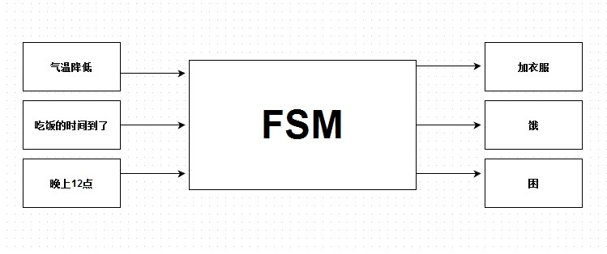
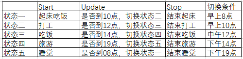

## 有限状态机

### 什么是有限状态机

有限状态机 又简称FSM(Finite-State Machine的首字母缩写)。所谓有限状态机，就是由有限个状态组成的机器。状态的产生以及改变都是由某种条件的成立而出现的。不考虑FSM的内部结构时，它就像是一个黑箱子，如下图



左边是输入一系列条件，FSM通过判定，然后输出结果

简单的说有限状态机有三个特性

* 状态总数（state）是有限的。
* 任一时刻，只处在一种状态之中。
* 某种条件下，会从一种状态转变（transition）到另一种状态。

### FSM的程序实现

这是用golang实现的一个有限状态机，实现的是游戏内一个NPC的状态，这个NPC在每天早上八点起床，早上10点打工赚金币，中午12点吃饭，下午14点去四处游走，晚上19点回来睡觉。那么就可以把这个NPC看成有五个状态。
其状态如下图所示：



定义一个状态接口，各状态实现这个接口

```
type IState interface {
	Start()
	Update()
	Stop()
	Value() string
}
```

定义一个状态机对象，为了方便测试，加了input_hour方便测试
```
type FSM struct {
	state     IState            // 当前状态
	registers map[string]IState // 状态集合
	def_state string            // 状态集合
	input_hour uint32 	    // 输入的时间
}
```

具体实现可以看代码

### 最后，总结一下

使用 FSM 模式设计和实现交互组件，有以下一些好处：

* 交互逻辑清晰，表达能力强
* 代码结构好，易维护

