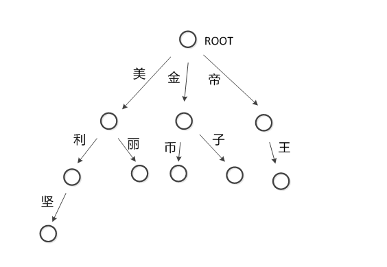

## 字典树

### 简介

- trie是一种搜索树，也称为字典树。最大的特点是共享字符串的公共前缀来达到提高效率的目的。
- trie的核心思想是空间换时间，缺点是内存占用高
- 最大限度地减少无谓的字符串比较，查询效率比哈希表高
  

   
### 性质

- 根节点不包含字符，除根节点外每一个节点都只包含一个字符。
- 从根节点到某一节点，路径上经过的字符连接起来，为该节点对应的字符串。
- 每个节点的所有子节点包含的字符都不相同。

### 构建

- 可以使用链表来实现，每个字符串都是一个链表

### 应用

- 词频统计
- 字符串检索
- 字符串搜索的前缀匹配
- ...

### 游戏屏蔽字替换

问题：假设上图就是游戏屏蔽字，有字符串“你来自美利坚帝国吗？”。需要将敏感词转换为*。

> 用3个指针来进行操作，分别是p1,p2,p3。p1指向屏蔽字树，p2和p3指向需要检测的字符串

1. 把p1指向root节点，p2和p3指向字符串开头的“你”字
2. “你”字不是p1的子节点，把p2和p3移动到下个字符“来”字，p1还是指向root节点
3. “来”字不是p1的子节点，把p2和p3移动到下个字符“自”字，p1还是指向root节点
4. “自”字不是p1的子节点，把p2和p3移动到下个字符“美”字，p1还是指向root节点
5. “美”字是p1的子节点（当前p1在root节点），把p1指向“美”节点，把p2移动到下个字符“利”，p3还是指向字符“美”
6. “利”字是p1的子节点（当前p1指向"美"节点），把p1指向“利”节点，把p2移动到下个字符“坚”，p3还是指向字符“美”
7. “坚”字是p1的子节点（当前p1指向"利"节点），把p1指向“坚”节点，“坚”节点是最后一个节点，查找结束，所以存在敏感词“美利坚”，p3到p2之间的区间就是敏感词，把p3到p2之间的字符都替换成*，最后把p2和p3都移动到字符"帝"，p1移动到root节点
8. “帝”字是p1的子节点（当前p1在root节点），把p1指向“帝”节点，把p2移动到下个字符“国”，p3还是指向字符“帝”
9. “国”字不是p1的子节点（当前p1指向"帝"节点），表示以“帝”字开头没有找到敏感词，把p2和p3都移动到字符“国”字，p1指向root节点
9. “国”字不是p1的子节点（当前p1指向root节点），把p2和p3都移动到下个字符“吗”字，p1指向root节点
10. “吗”字不是p1的子节点（当前p1在root节点），把p2和p3移动到下个字符“？”字，p1还是指向root节点
11. “？”字不是p1的子节点（当前p1在root节点），由于"？"已经是最后一个字符了，全部替换结束。

#### 伪代码

```go
func SensitiveTransform(word string) string {

	t := []rune(strings.ToLower(word)) // 转换为unicode数组
	p1 := tree.GetRoot()               // p1指向树的根节点
	p2 := t[0]                         // p2是过滤内容的第一个字符
	var p2Index, p3Index int           // p2的位置,p3的位置,默认是过滤内容的第一个字符的位置
	newWord := word                    // 过滤后的字符串

	// p3指向最后一个字符，则结束
	for ; p3Index < len(t); {

		// 遍历从p3开始到结尾的字符串
		for i := p3Index; i < len(t); i++ {
			char := t[i]

			if !p1.Contains(p2) {

				// 如果p2不是p1子节点，说明以p3开始的内容不需要屏蔽，p3指向下一个位置，p2指向p3，并将p1重置到root节点，终止循环
				p2Index = p3Index + 1
				p3Index = p3Index + 1

				if p2Index < len(t) {
					p2 = t[p2Index]
				}
				p1 = tree.GetRoot()

				break
			} else {

				// 如果p2是p1的子节点，p1节点移动到p2内容对应的节点上，p2移动到下个位置

				// 获取p1的子节点
				p1 = p1.GetChildNode(char)

				// 移动P2到下个位置
				p2Index = p2Index + 1
				if p2Index < len(t) {
					p2 = t[p2Index]
				}

				if !p1.HasChild() {

					// p1没有子节点，树的某条路径遍历完了，说明字符串中含有敏感词
					p1 = tree.GetRoot()

					// 将敏感词替换成*
					temp := []rune(newWord)
					newWord = string(temp[:p3Index]) + strings.Repeat("*", p2Index-p3Index) + string(temp[p2Index:])

					// p3移动到p2的位置
					p3Index = p2Index
				}
			}
		}
	}

	return newWord
}
```

#### 时间复杂度

- 匹配字符串：假设字符串的长度为n，我们需要遍历n遍，如果敏感词的长度为m，则最坏的情况下，需要遍历m遍，所以时间复杂度为O(m*n)
- 构建：如果有t个敏感词，每个敏感词的长度是m，那构建trie树的时间复杂度是O(m*t)
